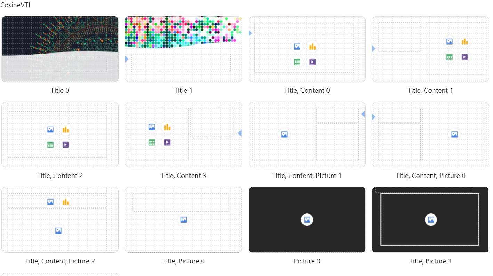

_所有来源的数据，都会先转换为如下的markdown中间格式，选用markdown主要是因为LLM对这种格式支持比较友好。然后再统一解析为ppt的数据结构
```markdown
格式如下：
# [ppt文件名称]
## [每页ppt标题]
- [每页ppt内容]


一个具体的示例如下：
# 业绩概览

## 收入情况 
- 总收入增长15%
- 市场份额扩大至30%

## 业绩图表
- OpenAI 利润不断增加


## 新产品发布
- 产品A: 特色功能介绍
- 产品B: 市场定位


```
ppt模板制作时，模板名称必须遵守以下格式。Title 表示标题，content 表示内容，
picture表示图片。 后面的1,2,3表示格式。
生成ppt的时候，会随机进行选择

注意中间的分割符", "逗号后有一个空格 

